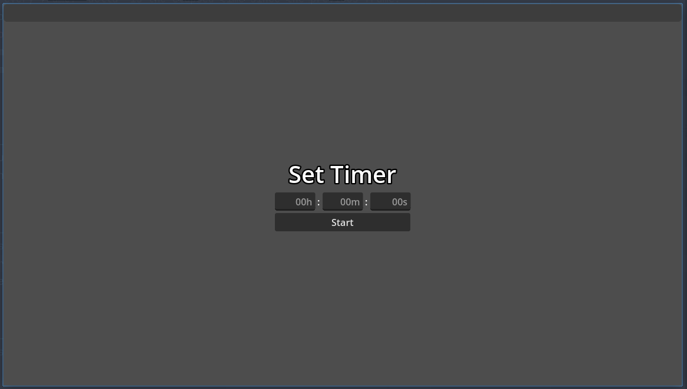
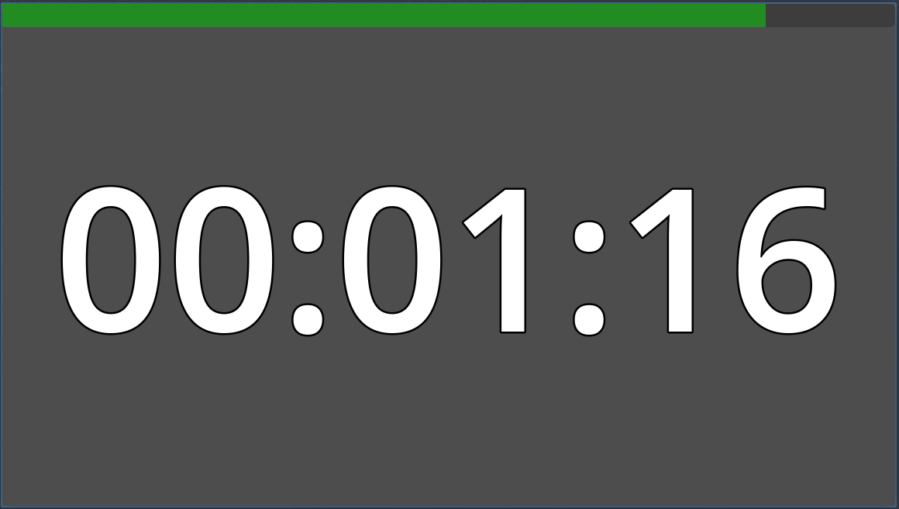

# Timer

I couldn't find a nice enough timer that would also be big enough on the screen so I decided to make my own real quick in Godot. It's nothing fancy but it does exactly what I need it to.

# Screenshots

*Setup*

*Started*